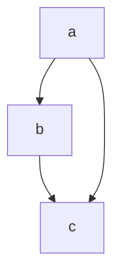
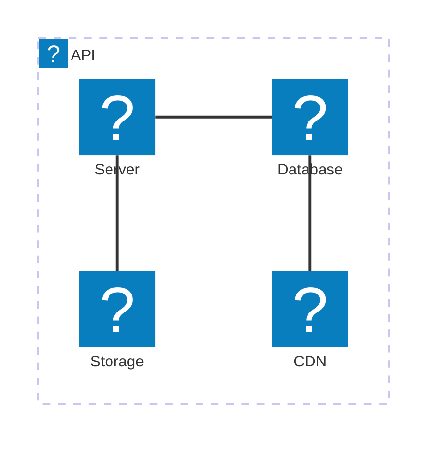

After a successful first week learning Astro, I decided to try some more. I wrote and imported a small component from memory!

```mermaid
flowchart TD
    a --> b
    b --> c
    a --> c
```

Icons

```mermaid
architecture-beta
  group api(logos:aws-lambda)[API]

  service db(logos:postgresql)[Database] in api
  service disk1(logos:aws-s3)[Storage] in api
  service disk2(logos:cloudflare)[CDN] in api
  service server(logos:docker)[Server] in api

  db:L -- R:server
  disk1:T -- B:server
  disk2:T -- B:db
```